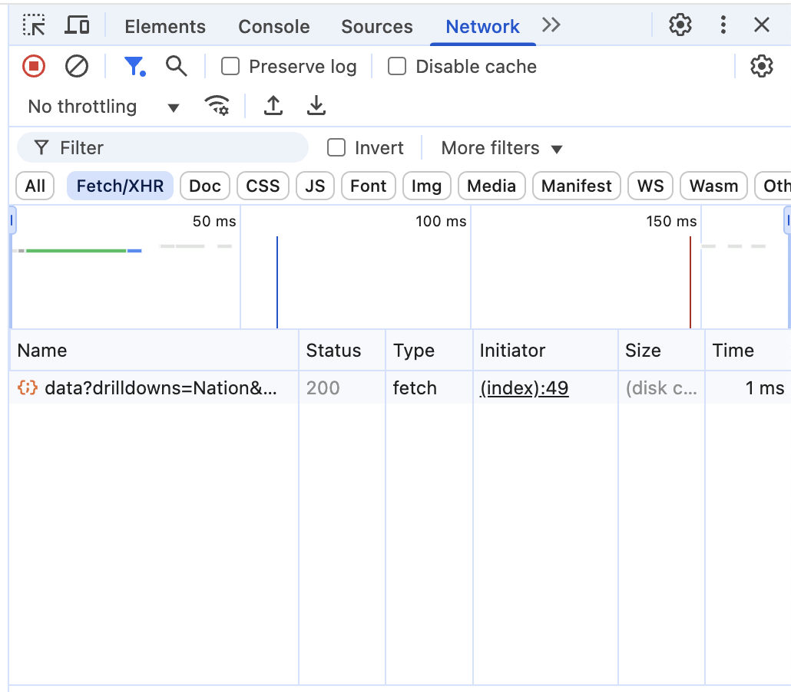

# This application shows the population of the US by year in a table styled with bootstrap

## To run the application:

First open a terminal window and navigate to the root directory.

Then, run `python3 -m venv venv` to create the virtual environment to prevent version conflicts.

Then, run `source ./venv/bin/activate` to activate the virtual environment.

Once inside the virtually environment, run `pip install uvicorn fastapi` to install the necessary dependencies to run the application.

Finally, run `uvicorn main:app` to run the application. Press command+click on the port number to view the app in the brower.
